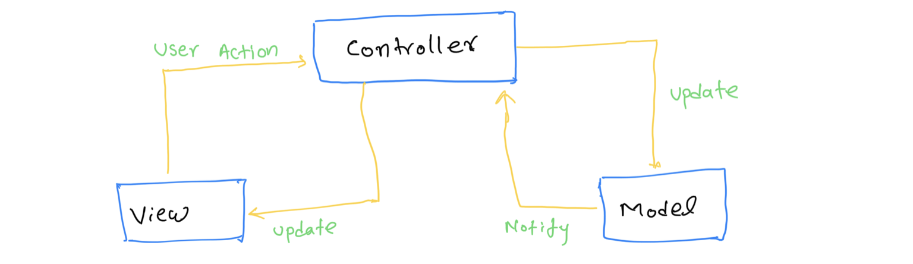
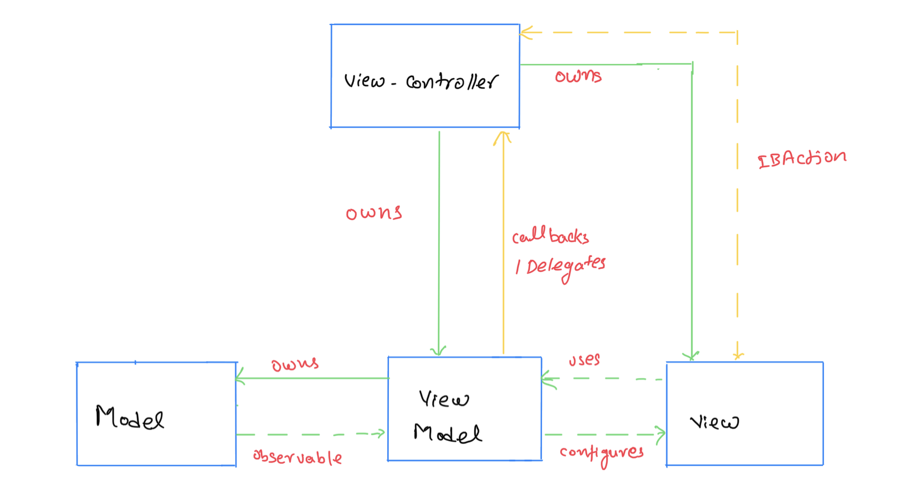
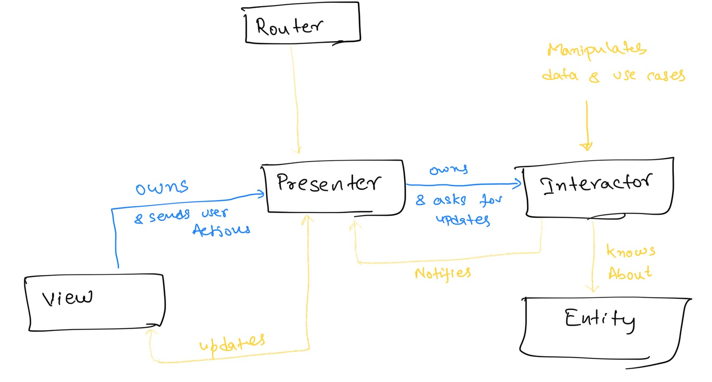

# iOS Architectures and Design Patterns

From last one week I have been reading about iOS design patterns and architecture patterns. This is summary posy of my understanding.

There is lot of articles and books around this topic. Here is listed of patterns I have read about.

1. MVC
2. MVVM
3. VIPER

### MVC (Model View Controller)
This is common and easy to implement. This is being followed in many iOS frameworks, and recommended by Apple. In this, whole code is categoriesed in three categories.

Following image displayes how this component communicates:

##### 1. Model:
In this categoy,involves all the data related logic. That may involve data fetching from web, processing data and updlaoding data. Model may be one class or more than one class. Model may be communicating multiple utils and managers for perform all the data fetching and processing.
All the Categories which will be part of model:
   - Network code
   - Persistance code
   - Parsing code
   - Manager and abstract code
   - Datasource and Delegate
   - Constants
   - Helpers
   - Extensions   
This is not suppoesed to contain any logic related to UI.This is most reusable part independent of UI code.

##### 2.View 
As name suggest this part is responsible for displaying info on UI. It may be subclasses of UIKit classe or storyboard or Xib. Sometime controllers containse view part for example: UITableViewController. View are supposed to be free of business logic and reusable in other places in app.
    View may contain following
    - UIView Subclasses
    - UIKit classes
    - Core Animation
    - Core Graphics
  ###### Red flags:
  - View inrecating with model
  - Contains any business logic
  - Trying to do anything, that is not related to UI?
##### 3. Contoller
This is least usable part, this contains communication between model and view. It holds following resposibilities:
- What should I access first: presistance or network?
- How often I shoulld refresh the app?
- What should the next screen be and in which circumstans?
- If the app goes to background what should I do next?
- The user tapped on cell, what should I do next>

##### Pros:
- View and model are separated well. 
- Less abstraction, best architectural pattern in terms of  speed of development.

##### Cons:
- View and controller are tightly coupled.(that makes them hard to test)
- If not careful, it may lead to massive view controller. When everything is dumped in view controller
- View Depends on two model and controller.

### Model-View-ViewModel

This pattern tries to solve massive view controller issue, without adding much abstractions. Add logic related to processing model is moved from controller to View-Model.Following images explains interaction between these controllers:

MVVM pattern is used when model need additional processing before displying info to UI. Not all the cases are fit to MVVM. But in most of cases it make things easier to test when it separate all the UI independent code to model and view-model. Which make both these parts testable. 

This pattern solves problem of modularity without much abstraction, which makes very populor design pattern in iOS (second, of course after MVC). Binding and reactive takes these pattern to next level.

##### VIPER
VIPER an application of Clean Architecture (Remember uncle Bob) in iOS. This pattern is breaks whole architecture to multiple components. VIPER's intials stands for View, Intector, Presentor, Entity, Router. Project is structured based on responsiblities. Each layer have own boundary and responsiblity.

Here is interaction sketch:

Role of all the components:
  - **View** : Displays whatever info need to displyed told by *Presenter*, and sends back user actions to presenter.
  - **Intercator** : Contains all the businesss logic, which need to performed in background or need to intercat with database.
  - **Presenter** : this component works same line as View Model of MVVM. It prepares view model.Gets data from interactor and prepares content and provides to view to present. Handling user inputs (requesting data from interactor or giving data to interactor to save). While we were using VIPER we ended up having lot of code here, be careful for this. You may create utils or separate classes for keeping your presenter code under control.
  - **Entity** : This is model objects used by *Interctor*. That may be for decoding fetched data or saving in database.
  - **Routing** : Contains navigation logic for describing physical navigation. Deciding order of different screens. This entry points for modules, which creates view and view creats presenter at time of initialization, which hold router and interactor. And all communication happens as displayed in sketch.
  
Challange with pattern is this needs a lot boilerplate code. Different protocols to be difined for interaction between different components.

This is very broad topic to cover, I just written this for summary of my understanding that may not totally 💯 accurate. 

Here are all the resources I have referered for reading. This sketches are recreated from diffrent articles listed here:
1. https://medium.com/ios-os-x-development/ios-architecture-patterns-ecba4c38de52
2. https://www.objc.io/issues/13-architecture/viper/
   

